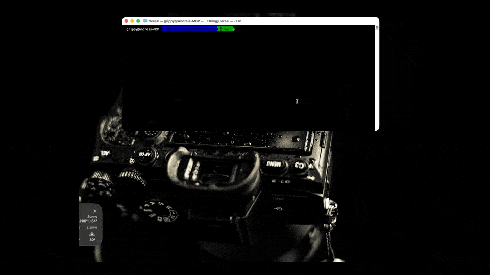

# It's Super Cereal...



A script to manage serial device terminals by automatically detecting connected devices and spawning screen sessions at 115200 baud.

Works on MacOS and Linux

## Features
- Lists existing serial devices in /dev/
- Prompts user to plug in serial devices
- Detects new devices after user confirmation
- Allows selection of specific device(s) or all devices
- Spawns terminal sessions with screen at 115200 baud

## Installation

   ```bash
   sudo chmod +x cereal.sh
   ```

### Setup Alias

To run the script from anywhere using the `cereal` command:

1. **Add to your shell configuration file:**

   For Zsh (macOS default):
   ```bash
   echo "alias cereal='$(pwd)/cereal.sh'" >> ~/.zshrc
   source ~/.zshrc
   ```

   For Bash:
   ```bash
   echo "alias cereal='$(pwd)/cereal.sh'" >> ~/.bashrc
   source ~/.bashrc
   ```

2. **Or manually add this line to your `~/.zshrc` or `~/.bashrc`:**
   ```bash
   alias cereal='/full/path/to/cereal.sh'
   ```